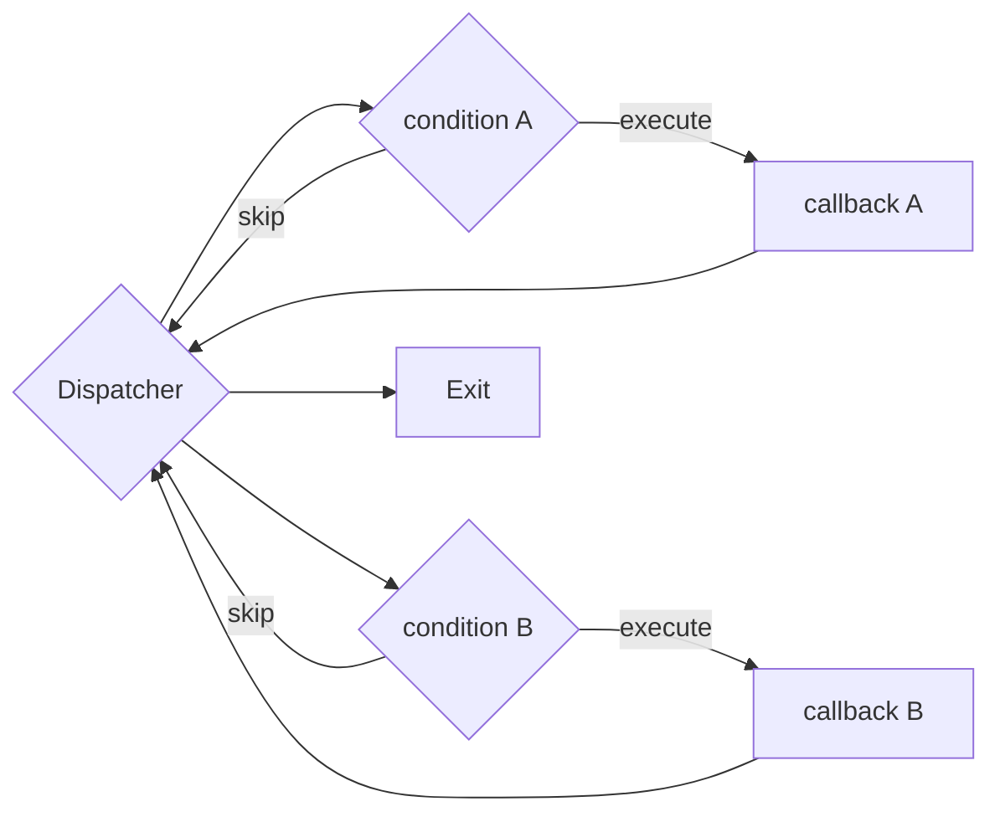
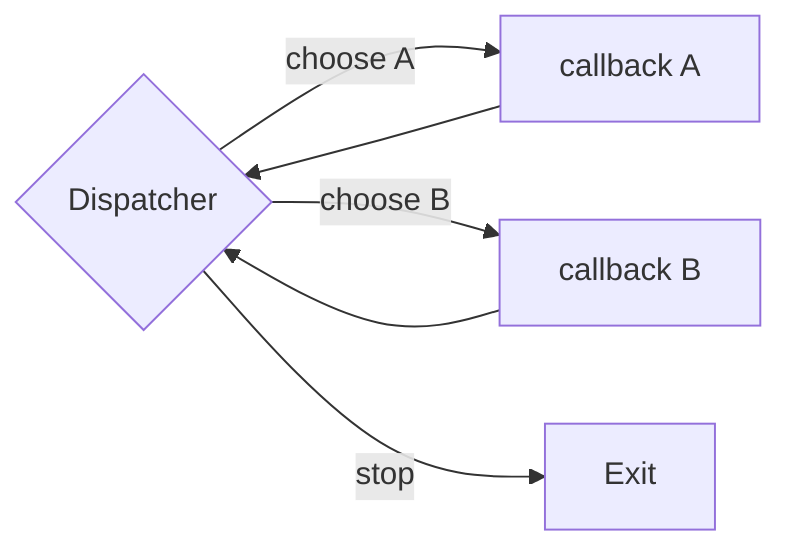
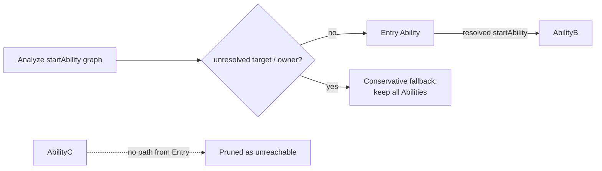
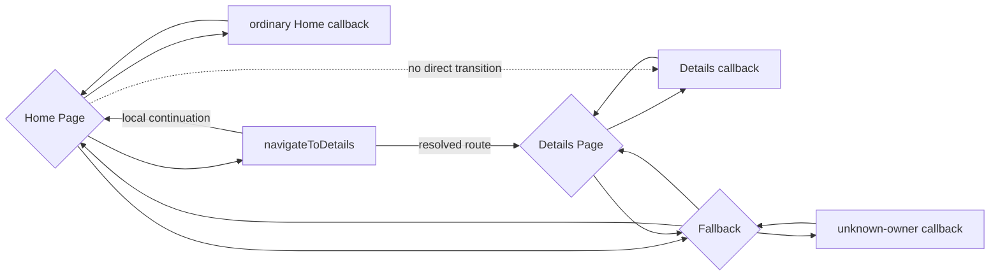

# Lifecycle CFG Optimizations

## 状态

当前研究主线。compact dispatcher 有清晰正向证据；Ability reachability pruning 有小幅正向证据。

## 方法动机

早期 Hierarchical 模型虽然增加了结构约束，却用很重的条件链表达 callback dispatcher，新增 CFG 节点抵消了 hierarchy 的收益。这里的目标是保持事件集合和 scope 语义不变，只减少 DummyMain 的结构放大。

## 核心机制

### Compact dispatcher

一个 scope head 直接连接所有可调用 invocation block；每个 invocation 执行后回到同一个 head。它替代“每个 callback 一个条件节点并串联”的表达，保留非确定选择语义，但显著减少 block、edge 和中间传播状态。

以两个 callback 为例，关闭 compact dispatcher 时，每个 callback 前都需要一个只用于表达“执行或跳过”的合成条件块：

开启 compact dispatcher 后，scope head 直接表达非确定选择：

两种 CFG 接受的 callback 序列都是 `(A | B)* -> Exit`。因此该优化不删除 callback，也不限制调用次数；它只删除没有领域语义的中间条件块。对于有 `N` 个可选 invocation 的单个 dispatcher，主要结构从 `1 + 2N` 个 block、`4N + 1` 条 edge 降为 `1 + N` 个 block、`2N + 1` 条 edge。

### Conservative Ability pruning

从 entry Ability 出发，只保留静态 `startAbility` 可达闭包。出现以下任一情况时关闭裁剪并保守保留：

- 缺少 entry Ability；
- `startAbility` 目标无法解析；
- 含 `startAbility` 的 Component 没有可解析 owner。

下图中，`AbilityB` 由 entry 可达，必须保留；`AbilityC` 在所有目标都能静态解析时可被删除。一旦存在未解析目标或 owner，则不执行这个删除，而是退化到全部保留。

Hierarchical 模型在更细的 Page scope 上使用同样的“有证据才剪枝”原则：普通 callback 回到当前 Page，只有静态解析的导航 callback 才可进入目标 Page；Page owner 或 route 不确定时进入 fallback。

`ohosTest` 和 `src/test` Ability 在公共收集阶段统一过滤，Flat 与 Hierarchical 使用相同规则；它不是 M1 的专属收益来源。

## 实现方式

- compact dispatcher：[`HierarchicalLifecycleModelCreator.ts`](../../src/lifecycle/HierarchicalLifecycleModelCreator.ts) 与 [`FlatLifecycleModelCreator.ts`](../../src/lifecycle/FlatLifecycleModelCreator.ts)
- 可达 Ability 与保守退化：[`LifecycleModelCreator.ts`](../../src/lifecycle/LifecycleModelCreator.ts)、[`AbilityCollector.ts`](../../src/lifecycle/AbilityCollector.ts)
- 优化开关：`LifecycleModelConfig.optimizations`，可分别关闭 `compactDispatcher`、`pruneUnreachableAbilities`。
- `opt-flat` 复用相同通用优化，作为隔离 hierarchy 独立贡献的基线。

## 关键实验

4 个真实应用的 M1 消融中，关闭 compact dispatcher 后：

| 指标 | M1 Full | No Compact | 变化 |
| --- | ---: | ---: | ---: |
| DummyMain blocks | 1,636 | 3,245 | +98.35% |
| DummyMain edges | 3,252 | 6,470 | +98.95% |
| lifecycle `processedEdges` | 1,496,415 | 1,729,246 | +15.56% |
| `propagationAttempts` | 2,047,128 | 2,512,790 | +22.75% |
| lifecycle IFDS | 20.055 s | 26.950 s | +34.38% |

五个消融配置均完成 4/4 项目，诊断集合相同。结构计数、传播计数和时间同向变化，compact dispatcher 是当前归因最明确的优化。

关闭 Ability pruning 会额外增加 7 个 block、14 条 CFG edge、2,330 条 lifecycle path edge 和 3,733 次 propagation attempt。收益较小，但方向由确定性计数支持。

作为组合效果，优化后的 Hierarchical 在 47 个共同成功真实应用上相对旧 Flat：IFDS 累计时间 -20.00%，`processedEdges` -11.37%，诊断集合一致。这个结果包含 compact dispatcher、Ability pruning 和 hierarchy，不能用来声称 hierarchy 单独贡献 20%。

原始数据：[`out/rq1.5/m1-full.json`](../../out/rq1.5/m1-full.json)、[`out/rq1.5/m1-no-compact.json`](../../out/rq1.5/m1-no-compact.json)、[`out/rq1.5/m1-no-ability-prune.json`](../../out/rq1.5/m1-no-ability-prune.json)、[`out/nullness-m1opt-full48-m0.json`](../../out/nullness-m1opt-full48-m0.json)、[`out/nullness-m1opt-full48-m1.json`](../../out/nullness-m1opt-full48-m1.json)。

## 当前证据

- compact dispatcher：已满足“机制明确、消融正向、语义门一致”，可作为论文方法组成部分。
- Ability pruning：已有小幅正向工作量证据，可作为辅助优化，不应包装成主要贡献。

## 为什么效果较好

IFDS 的成本不仅取决于业务方法数量，也取决于事实需要穿过多少合成控制流节点。compact dispatcher 直接删掉大量只用于表达非确定选择的中间节点，所以在不减少事件的情况下，同时降低 reached statements、path edge 和 propagation attempts；这比仅提升 ownership 覆盖更直接。

具体地说，如果某个 dispatcher 到达了 `F` 个带上下文的 IFDS 事实，那么 `N` 个合成条件块带来的额外工作不是常数级的 `N`，而是近似 `F * N`。这些节点还会继续放大 PathEdge 传播、去重查询和 successor flow-function 调用。因此 compact dispatcher 的收益本质上是“减少每个事实要穿过的合成结构”，而不是“少分析一些 callback”。

## 已知限制

- 所有时间数据均为单轮运行，主要归因依据应是确定性结构和传播计数。
- Ability pruning 只覆盖可静态解析的 `startAbility`，动态路由会触发保守退化。
- 组合实验不能分摊 hierarchy 与各通用优化的贡献；论文中必须同时报告 `opt-flat` 公平基线。
